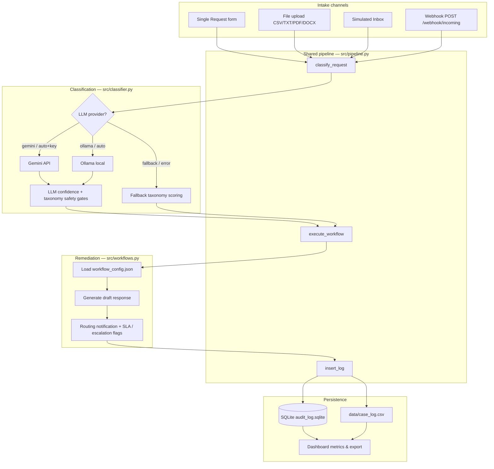

# Incoming Request Processing Workflow — AI Prototype

## Overview
Operations teams currently read inbox messages manually, decide the request type and urgency, then choose next steps. This Streamlit prototype **auto-classifies** each incoming request and runs a **branch-specific remediation workflow**, producing operational outputs (draft response, routing notification, SLA/follow-up flags, escalation flags, and an audit trail).

**Design approach:** This is an **AI-powered prototype** (LLM classification + LLM draft responses) with **governed ops routing** — a configurable routing taxonomy acts as fallback and as policy guardrails on top of the model, so ambiguous or conflicting cases still route safely to **Needs Human Review**.

### What the LLM does (when available)
1. **Classification** — `request_type`, `urgency`, `confidence`, `sub_topic`, `rationale`, `extracted_details`
2. **Draft response** — customer-facing acknowledgement / answer / clarification per branch

### What the taxonomy does
1. **Full fallback** — entire classification when LLM is off or fails (`LLM_PROVIDER=fallback`, quota error, Ollama down)
2. **Safety gates on LLM output** — after a successful LLM call, re-check `data/routing_taxonomy.json` for:
   - conflicting intents (e.g. billing dispute + refund policy question → Needs Human Review)
   - ambiguous weighted scores across categories
   - low taxonomy confidence on operational signals
   - vague / insufficient detail (e.g. “the thing we discussed earlier”)
3. **LLM self-gating** — if the model returns `confidence` below 0.60, route to Needs Human Review regardless

`processing_mode` stays `llm` when the provider succeeded; rationale notes when a taxonomy safety gate overrode the model’s branch choice.


### High-level design
The app is a **single Python codebase** with two entry points that share one pipeline:

| Layer | Role | Key files |
|---|---|---|
| **Intake** | Collect requests from UI, files, inbox, or HTTP | `app.py`, `api.py`, `src/file_parser.py`, `src/sample_data.py` |
| **Classification** | Infer type, urgency, confidence, rationale | `src/classifier.py`, `data/routing_taxonomy.json` |
| **Remediation** | Branch-specific actions, drafts, routing, SLA flags | `src/workflows.py`, `workflow_config.json`, `data/knowledge_base.md` |
| **Audit & dashboard** | Persist cases and surface ops metrics | `src/logger.py`, `src/dashboard.py`, `audit_log.sqlite`, `data/case_log.csv` |

Both **Streamlit** (`app.py`) and the **FastAPI webhook** (`api.py`) call the same function: `process_incoming_request()` in `src/pipeline.py`. That keeps UI and API behaviour identical.

### Request flow


### Classification path
1. `resolve_llm_provider()` in `src/utils.py` reads `.env` (`LLM_PROVIDER`, Gemini key, Ollama URL/model).
2. If **Gemini** or **Ollama** succeeds → structured JSON → `ClassificationResult` (`processing_mode=llm`).
3. **Governed routing on LLM results:**
   - Model `confidence` &lt; 0.60 → **Needs Human Review**
   - Taxonomy **safety gates** (conflicts, ambiguity, weak signals, vague text) → override to **Needs Human Review** when ops policy requires it (see `data/routing_taxonomy.json` `conflict_rules`)
4. On missing config, connection failure, or API error → **full fallback** taxonomy scoring (`processing_mode=fallback`).

### Remediation path
1. `execute_workflow()` looks up the classified branch in `workflow_config.json` (actions, routing team, SLA, status).
2. Draft response is generated via the same LLM provider when available; otherwise deterministic templates + KB lookup (`data/knowledge_base.md` for enquiries).
3. Outputs include `request_id`, `actions_triggered`, `generated_response`, `routing_notification`, escalation/human-review flags.

### Production-style extension (not implemented)
In a real deployment, upstream systems (Gmail, Zendesk, web forms) would POST to the webhook. This prototype uses Python orchestration instead so the full flow runs offline in one repo.

## Workflow design
```
Incoming request (form / file upload / simulated inbox / local webhook)
  → Classification (type + urgency + confidence + rationale)
  → Branch router
      → Complaint
      → General Enquiry
      → Service Request
      → Escalation / Urgent
      → Needs Human Review (low confidence / ambiguous)
  → Operational outputs + SQLite audit log + dashboard
```

### Classification logic
- **LLM Mode** (AI-powered) when a configured provider succeeds:
  - **Gemini** (cloud) when `GEMINI_API_KEY` is set and `LLM_PROVIDER` is `auto` or `gemini`
  - **Ollama** (local) when `LLM_PROVIDER` is `auto` (no Gemini key) or `ollama`
  - LLM returns structured classification JSON; same provider drafts customer responses in `src/workflows.py`
- **Governed routing** on LLM output (taxonomy safety gates + low model confidence) → **Needs Human Review** for ambiguous/conflicting/vague cases — even in LLM mode
- **Fallback Demo Mode** when LLM is disabled or unavailable — full classification via `data/routing_taxonomy.json` (weighted signals + ambiguity/conflict rules; not hardcoded sample matching)

### Remediation strategy (each branch ≥ 2 downstream actions)

| Branch | Default urgency | Downstream actions (summary) | Typical outputs |
|---|---|---|---|
| Complaint | High | Acknowledge → route senior support → priority log → 2-hour follow-up | Draft acknowledgement, routing notice, priority status |
| General Enquiry | Low | Sub-topic → KB answer → resolve/log | Knowledge-base draft, Resolved status |
| Service Request | Medium | Extract details → route Account Ops → confirmation → SLA | Confirmation message, 1-business-day SLA |
| Escalation / Urgent | Critical | Human review → urgent ack → notify supervisor → pause auto-resolve | Escalation flag ON, supervisor alert (simulated) |
| Needs Human Review | Medium | Manual triage → clarification request → pending review | Clarification questions, Pending Review |

Routing/notifications are **simulated** in the UI and audit log.

## App features
1. **Single Request Intake** — paste any text; system auto-classifies (no manual type picker).
2. **File Upload / Batch** — CSV, TXT, PDF, DOCX; open any case for full remediation detail.
3. **Simulated Inbox** — 10 demo messages covering all branches; process one or all.
4. **Webhook Intake** — local FastAPI endpoint (`api.py`) for automated push intake.
5. **Dashboard / Audit Log** — metrics, charts, filters, CSV export, case drill-down.

## Tools used
- Python, Streamlit, Pandas, FastAPI + Uvicorn (local webhook)
- SQLite audit trail (`audit_log.sqlite`) + CSV mirror (`data/case_log.csv`)
- LLM providers: local **Ollama** and/or cloud **Google Gemini** (`google-genai`)
- `pypdf`, `python-docx` for document intake
- Config-driven workflows: `workflow_config.json`
- Mini knowledge base: `data/knowledge_base.md`

## Setup
```bash
python -m venv .venv
# Windows:
.venv\Scripts\activate
# macOS/Linux:
# source .venv/bin/activate

pip install -r requirements.txt
copy .env.example .env   # Windows; do not submit your real .env
# cp .env.example .env   # macOS/Linux; do not submit your real .env
streamlit run app.py
```

Optional LLM mode — add to `.env` (never commit real keys):

**Option A — Local Ollama (recommended, no API key):**
```bash
LLM_PROVIDER=ollama
OLLAMA_MODEL=llama3.2
# Install Ollama from https://ollama.com then: ollama pull llama3.2
```

**Option B — Google Gemini (cloud):**
```bash
LLM_PROVIDER=gemini
GEMINI_API_KEY=your_key_here
GEMINI_MODEL=gemini-2.0-flash
```

**Option C — Auto (default):** uses Gemini when `GEMINI_API_KEY` is set, otherwise tries Ollama.

Set `LLM_PROVIDER=fallback` to force deterministic mode with no LLM calls.

If the chosen provider is unavailable or the call fails, the demo still works fully in **Fallback Demo Mode**.

**After installing Ollama:** ensure the Ollama app is running, `ollama pull llama3.2` (or your chosen model), set `OLLAMA_MODEL` to match `ollama list`, then restart Streamlit.

## Local webhook API (optional automation demo)
This shows how an upstream system could push requests into the same remediation pipeline.

```bash
# Terminal 1 — Streamlit UI
streamlit run app.py

# Terminal 2 — webhook API
uvicorn api:app --reload --port 8000
```

Example request (PowerShell-friendly JSON):
```bash
curl -X POST http://127.0.0.1:8000/webhook/incoming -H "Content-Type: application/json" -d "{\"request_text\":\"Please activate my new business account.\",\"requester_name\":\"Priya\",\"channel\":\"webhook\"}"
```

Health check: `GET http://127.0.0.1:8000/health`  
Or use the **Webhook Intake** workspace in the Streamlit app (in-process or HTTP mode).

## Sample inputs
- Batch CSV: `data/sample_requests.csv`
- Processed output log: export from **Dashboard / Audit Log** (CSV export) or use runtime `data/case_log.csv`
- Simulated inbox definitions: `src/sample_data.py`
- Knowledge base: `data/knowledge_base.md`

## End-to-end examples (one per branch)

### 1) Complaint
- **Input:** “I was charged twice for my last invoice and nobody has responded. This is unacceptable and I want this fixed today.”
- **Classification:** Complaint · High
- **Branch actions:** empathetic acknowledgement; route to Senior Customer Support; priority log; 2-hour follow-up
- **Outputs:** draft acknowledgement + routing notification + status `Escalated`

### 2) General Enquiry
- **Input:** “Can you explain your refund policy and how long support usually takes to respond?”
- **Classification:** General Enquiry · Low
- **Branch actions:** sub-topic detection; KB response; resolve; log
- **Outputs:** KB-based answer + status `Resolved`

### 3) Service Request
- **Input:** “Please activate my new business account and update the billing contact to Priya Menon.”
- **Classification:** Service Request · Medium
- **Branch actions:** extract details; route Account Operations; confirmation; 1-business-day SLA
- **Outputs:** confirmation draft + routing notification + status `Routed`

### 4) Escalation / Urgent
- **Input:** “Our service is down during launch day. I need a supervisor immediately or we will escalate this legally.”
- **Classification:** Escalation / Urgent · Critical
- **Branch actions:** human review flag; urgent acknowledgement; supervisor notify (simulated); pause auto-resolution
- **Outputs:** escalation flag ON + status `Human Review Required`

### 5) Needs Human Review
- **Input:** “I was charged twice, but I also just want the refund policy and pricing details.”
- **Classification:** Needs Human Review · Medium (low confidence / conflicting signals)
- **Branch actions:** manual triage; clarification questions; pending review; do not auto-resolve
- **Outputs:** clarification draft + status `Pending Review`

## Project structure
```
app.py
api.py                 # local FastAPI webhook
requirements.txt
README.md
workflow_config.json
.env.example
src/
  pipeline.py, classifier.py, workflows.py, file_parser.py, logger.py
  sample_data.py, dashboard.py, utils.py, models.py
data/
  sample_requests.csv, routing_taxonomy.json, knowledge_base.md, case_log.csv (created at runtime)
```
